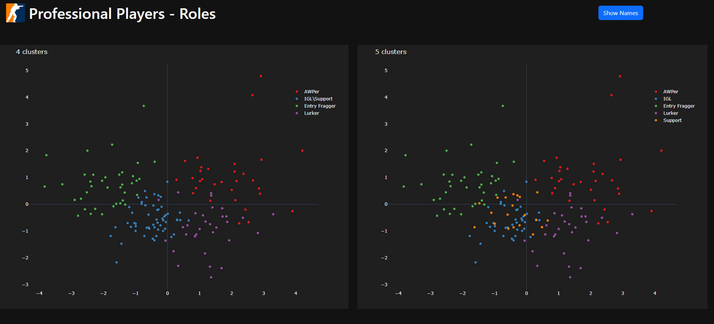
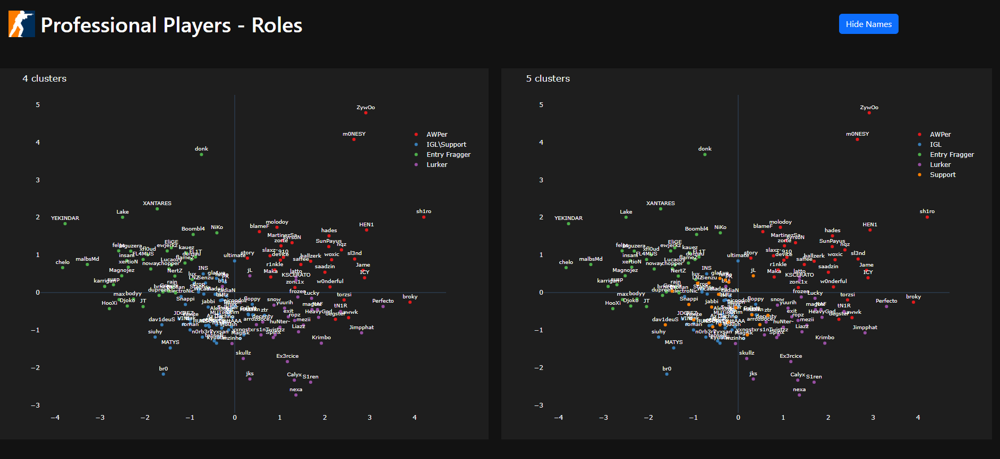

# Counter-Strike: Player Clustering
The idea of this project is to retrieve and analyze professional Counter Strike players' statistics.
The final goal is to use the unsupervised learning algorithm K-means to cluster the players and separate them into in-game roles.

It is an end-to-end project: web-scraping, data handling, feature engineering and modeling. The data is extracted from the website hltv.org.

The data retrieved is from January 2024 to October 2025, using the filter of 1 star on the matches 
(1 star = match that contains at least one team ranked top 20).

## Project Structure
- `hltv`:
  - Scraps data from the website hltv.org using BeautifulSoup, Selenium and undetected_chromedriver
  - Load data as dataframe then saves into selected filepath
- `analysis`:
  - cleaning.py: reads, organizes and clean the raw data, then applies feature engineering
  - clustering.py: uses K-means clustering to separate the players into roles (AWPer, Entry Fragger, IGL, etc.)
  - dashboard.py: creates a dashboard using Dash and Plotly, highlighting the results of the clustering
- `assets`:
  - contains all the files and images used in other parts of the project

## Technologies
- **Python** 3.9
- **BeautifulSoup**, **Selenium** and **undetected_chromedriver** for web-scraping
- **Sklearn** for data handling and clustering
- **Dash** and **Plotly** for interactive visualization

## How to Run

1. Clone the repository:
   ```bash
   git clone https://github.com/eriqsp/counter-strike-analysis.git
   cd counter-strike-analysis
2. Install dependencies
   ```bash
   pip install -r requirements.txt
3. Create a *.env* file and add the variable FILEPATH. This variable represents the directory in which the files scraped will be saved into.
   ```bash
   Example: FILEPATH=C:\counter_strike 
4. Run the scrapper to get the raw data
   ```bash
   python hltv\scrapper_run.py
5. Run the dashboard
   ```bash
   python analysis\dashboard.py

## Example




## About the Performance
The way I assessed the clustering performance was by using the data available online from the players, manually checking if the players
from the same role are in the same cluster. One alternative would be to build a list with players and roles 
and then check the cluster performance based off on the list. I know some players are assigned wrong roles (e.g. blameF as AWPer, Boombl4 as Entry Fragger, etc.), 
but those are closer to the middle of the plot, where it is more difficult to accurately predict the player's in-game role.

## Feature Selection
I have tried to add other features like "traded" and "flash assists" but the clusters got worst
(players that are clearly from different roles were in the same cluster\role and vice-versa).
At the same, I think it would be great to see the clustering performance after adding more features, like
number of awp kills (I couldn't collect it as easily).

## Number of Clusters
The optimal number of clusters is 4 right now - for the available and chosen features.
The roles in this case are:

- Cluster 0 > IGL\Support
- Cluster 1 > AWPer
- Cluster 2 > Entry Fragger
- Cluster 3 > Lurker

## PCA
I've applied the PCA (Principal Component Analysis) framework after the clustering to visualize the clusters
in a 2D space. In this case, 2 PCs explain 64% of the total number of variables (6). 3 PCs explain 79%.
In the 2D space you can have a clear view of the clusters and its boundaries. The 3D figure (using 3 PCs) is not as 
good, so I hid it.

## Next Steps
- Automatically assess performance using a list of players and roles
- Get more relevant features (e.g. awp kills)
